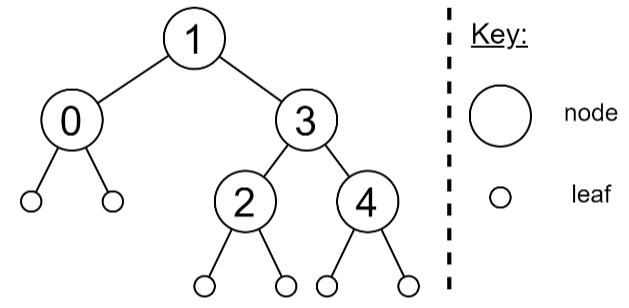

# Haskell

Livro: [Learning Hakell](https://moodle2425.up.pt/pluginfile.php/95817/mod_resource/content/21/Learning%20Haskell%20by%20Solving%20Problems.pdf)

## Functional Programming

Programs in C or Java are usually imperative: sequences of commands that modify variables in memory.

In a purely functional program, we **never modify variables**: we only apply functions.

### Example of a Functional Program in Haskell

```haskell
main = print (sum (map (^2) [1..10]))
```

- [1..10] is the sequence of integers from 1 to 10
- map (^2) calculates the square of each value
- sum sums the sequence
- print prints the result

### Advantages of Functional Programming

- More concise programs
- Closer to a mathematical specification
- More focus on problem analysis and less on “debugging”
- Helps improve programming skills in any language!
- Greater modularity: breaks problems into small, reusable components
- Correction guarantees: allows for proof-based correctness and simplifies automated testing
- Concurrency/parallelism: the execution order does not affect the results

### Disadvantages of Functional Programming

  - Compilers and interpreters are more complex
  - Hard to predict execution costs (time/space)
  - Some low-level programs require precise control over time/space
  - Certain algorithms are more efficient when implemented imperatively

### Interpreter Commands
| Comand | Abrev. | Meaning |
|--------|--------|---------|
| `:load ficheiro` | `:l` | load a file |
| `:reload` | `:r` | reload modifications |
| `:edit` | | edit the current file |
| `:set editor prog` | | set the editor |
| `:type expr` | `:t` | show the type of an expression |
| `:help` | | get help |
| `:quit` | `:q` | end the session |

---
---

## 1. Introduction

### 1.2. Simple Expressions
| Operator   | Comment                                       |
|------------|-----------------------------------------------|
| +, -       | Addition, subtraction                         |
| *, /       | Multiplication, division (floating-point)     |
| ^, ^^, **  | Exponentiation (non-negative integer, integer, floating-point) |
| div        | Integer division quotient                     |
| mod        | Integer division remainder                    |
| ==         | Equality                                      |
| /=         | Inequality                                    |
| <, <=, >, >=| Comparison                                    |
| not        | Negation                                      |
| &&, \|\|   | Logical conjunction and disjunction           |

<p align="center">Table 1.1 Some basic numeric and logical operators in Haskell</p>

> [**EA-1:** IN-3, IN-4](EA/EA1.hs)

---
### Syntax

- Function arguments are separated by spaces.
- Function application has higher precedence than any operator.

| Haskell	| Usual Notation |
|---------|----------------|
| `f x`	| `f(x)` |
| `f (g x)`	| `f(g(x))` |
| `f (g x) (h x)`	| `f(g(x), h(x))` |
| `f x y + 1`	| `f(x, y) + 1` |
| `f x (y+1)`	| `f(x, y + 1)` |
| `sqrt x + 1`	| `√x + 1` |
| `sqrt (x + 1)`	| `√(x + 1)` |

- An operator can be used as a function by enclosing it in parentheses.
- Conversely, a function can be used as an operator by enclosing it in backticks.

| Haskell	| Equivalent | 
|---------|------------|
| `(+) x y`	| `x + y` | 
| `(*) y 2`	| `y * 2` | 
| `` x \mod` 2` `` | `mod x 2` | 
| `` f x \div` n` `` | `div (f x) n` | 


---
### 1.3. Simple functions

In Haskell, since functions behave like any other entity, they are defined using the same syntax as variables. In fact, variables (in the sense as those used in imperative languages) are a particular case of a function with no arguments.

The general syntax to define a function is:
`<function name > <argument 1> <argument 2> ... = <expression >`

Valid function and argument names begin with a lowercase letter, followed by letters, numbers, underscores (example: func_2 ) and apostrophes ( func' ). The names used cannot be any of the following reserved keywords: case class data default deriving do else if import in infix infixl infixr instance let module newtype of then type where .

#### Notes
- Function and variable names must start with lowercase letters and can include letters, digits, underscores, and apostrophes.
- Indentation indicates the scope of declarations

```haskell
a = b+c
  where b = 1
        c = 2
d = a*2
```
corresponds to:
```haskell
a = b+c
  where {b = 1;
        c = 2}
d = a*2
```
- All definitions in the same scope must start in the same column.


> [**EA-1:** IN-6](EA/EA1.hs)

---
### 1.4. Conditional structures
There are various ways of writing conditional structures in Haskell, which, given a condition, determine which expression will be computed. The four main conditional structures are:
- if-then-else expressions.
```haskell
absoluto :: Float -> Float
absoluto x = if x>=0 then x else -x

-- Note1: in haskell, 'if...then...else' is an expression not a command
-- Note2: 'else' is mandatory
```
- guards.
```haskell
absoluto :: Float -> Float
absoluto | x>=0 = x
         | otherwise = -x

-- Note: In Haskell, local definitions cover all alternatives if the where clause is aligned with the guards. This allows you to define auxiliary functions or variables .

raizes :: Float -> Float -> Float -> [Float]
raizes a b c
    | delta>0 = [(-b+sqrt delta)/(2*a),
                 (-b-sqrt delta)/(2*a)]
    | delta==0 = [-b/(2*a)]
    | otherwise = []
    where delta = b^2 - 4*a*c
```
- pattern matching.
```haskell
(&&) :: Bool -> Bool -> Bool
True && True = True
True && False = False
False && True = False
False && False = False

-- Note:
x && x = x -- ERROR, we cannot repeat variables in patterns
x && y | x==y = x -- OK
```
- case expressions.
```haskell
null :: [a] -> Bool
null xs = case xs of
            [] -> True
            (_:_) -> False

equivalent to

null :: [a] -> Bool
null xs = case xs of
            [] -> True
            _ -> False
```

> [**EA-1:** IN-13](EA/EA1.hs)

---
### 1.5. Recursion
In Haskell, there is not iteration, namely `for` and `while` cycles. To execute a fragment of code a certain number of times until a condition is met, one must use recursion, where a function's expression contains a call to itself.

> [**EA-2:** IN-17, IN-18](EA/EA2.hs)

---

### Lambda Expressions

In Haskell, we can define an anonymous function (i.e., a function without a name) using a lambda expression. Lambda expressions:
  - Allow the definition of functions whose results are other functions.
  - Help avoid naming short functions.

Here's a simple example of a lambda function:
```haskell
\x -> 2*x + 1  -- A function that corresponds to 2x + 1 for each x.
```
You can use this lambda expression like this:
```bash
> (\x -> 2*x+1) 1
3
> (\x -> 2*x+1) 3
7
```
You can also define named functions using lambda expressions. For example:
```haskell
soma x y = x + y

-- This is equivalent to:

soma = \x -> (\y -> x + y)
```
Lambda expressions are particularly useful when working with higher-order functions. For instance, instead of defining a separate function to square numbers, you can use a lambda expression directly:
```haskell
quadrados = map f [1..10]
    where f x = x^2

-- We can write this as:

quadrados = map (\x -> x^2) [1..10]
```

---
### Operators and Sections

Expressions of the form `(x ⊗)` and `(⊗ x)` are called **sections**. They define the resulting function by applying one of the operator's arguments.

Here are a couple of examples using sections:
```bash
> (+1) 2
3
> (/2) 1
0.5
```
In these examples:
  - ( + 1 ) is a section that takes a number and adds 1 to it.
  - ( / 2 ) is a section that takes a number and divides it by 2.

For instance, consider the following function definition:
```haskell
quadrados = map (\x -> x^2) [1..10]
```
This can be expressed more succinctly using a section:
```haskell
quadrados = map (^2) [1..10]
```

---
---

## 2. Fundamentals on types

### 2.1. Elementary types
The type of any expression or function can be checked in GHCI using the `:type` command (or `:t` , for short). Examples:
```bash
Prelude > :type True
True :: Bool
```
```bash
Prelude > :type 'a'
'a' :: Char
```

| Type     | Comment                                                                 |
|----------|-------------------------------------------------------------------------|
| **Bool** | Boolean. Two values: True and False.                                    |
| **Char** | Character. Denoted by single quotes.                                    |
| **Int**  | Integer. Fixed-precision (i.e. has a maximum size) depending on the system's architecture. |
| **Integer** | Integer. Arbitrary precision.                                        |
| **Float** | Floating-point. Single precision (32 bits).                            |
| **Double** | Floating-point. Double precision (64 bits).                           |
<p align="center">Table 2.1 Most common elementary types in Haskell</p>

The Int type has the advantage over Integral of being more efficient in terms of time and space, since the variable's size is fixed. However, if not handled properly the former may lead to silent overflow issues.

---
### 2.2. Tuples
A tuple is a sequence of elements with a fixed size. The elements do not have to be all of the same type. They are denoted by parenthesis.

Tuples with one element do not exist as they have the type of the actual element.There is a single type for a tuple with zero elements, the unit type ().

```bash
Prelude > :type (True ,'a')

(True ,'a') :: (Bool , Char)

Prelude > :type ('x',(True ,False))

('x',(True ,False)) :: (Char , (Bool , Bool))
```

| Function | Comment                                                   | Example            |
|----------|------------------------------------------------------------|--------------------|
| **fst**  | Returns the first element of a pair (binary tuple).         | `fst (3, 8) -> 3`  |
| **snd**  | Returns the second element of a pair (binary tuple).        | `snd (3, 8) -> 8`  |
<p align="center">Table 2.2 Some Prelude functions for tuples</p>

> [**EA-1:** FT-3, FT-4](EA/EA1.hs)

---
### 2.3. Lists
A list is a variable-sized sequence of elements of the same type. It has several key differences from tuples:
- Lists have a variable size, which means that a function that receives a list as input can handle lists with 2 or 1000 elements.
- They are homogeneous: all of the elements in a list must have the same type.
- A list can have one element (singleton list)

Empty lists are represented as [] . A String is a particular case of a list. It corresponds to an array of characters, [Char] .

Lists can be defined in various ways:
- Using square-brackets. This is used to represent lists of fixed size.
  
  `[1,4,7,10,13]`

- Using the "cons" operator ( : ).
  
  `1:4:7:10:13:[]`
  
- Using ranges.
  
  `[1,4..13]`

- Using list comprehensions
  
  `[x | x <- [1..15], mod x 3 == 1]` 

| Function | Comment | Example |
|----------|---------|---------|
| **(++)**    | Appends two lists. | `[1,2] ++ [3,4] -> [1,2,3,4]`  |
| **head**    | Extracts the first element of non-empty lists.  | `head [1,2,3] -> 1` |
| **tail**    | Removes the first element of non-empty lists (output can be [] if input is a singleton). | `tail [1,2,3] -> [2,3]` |
| **last**    | Extracts the last element of non-empty lists. | `last [1,2,3] -> 3` |
| **init**    | Removes the last element of non-empty lists. | `init [1,2,3] -> [1,2]` |
| **elem**    | Checks if a value is contained in a list. | `elem 3 [1,2,3] -> True` |
| **(!!)**    | Returns the n-th element of a list (with indices starting at 0). | `[1,2,3] !! 1 -> 2` |
| **length**  | Returns the number of elements in a list. | `length [1,2,3] -> 3` |
| **reverse** | Inverts the order of the elements in a list. | `reverse [1,2,3] -> [3,2,1]` |
| **take**    | Extracts the first n elements of a list. | `take 2 [1,2,3] -> [1,2]` |
| **drop**    | Removes the first n elements of a list. | `drop 2 [1,2,3] -> [3]` |
| **repeat**  | Creates an infinite list with x as the value of all elements. | `repeat 1 -> [1,1,1,1,1,1...]` |
| **cycle**   | Creates an infinite repetition of a list. | `cycle [1,2,3] -> [1,2,3,1,2,3...]` |
| **zip**     | Creates a list with the corresponding pairs of two lists. | `zip [1,2,3] "abc" -> [(1,'a'),(2,'b'),(3,'c')]` |
| **sum**     | Adds all of the numbers in the list. | `sum [1,2,3,4] -> 10` |
| **product** | Multiplies all of the numbers in the list. | `product [1,2,3,4] -> 24` |

<p align="center">Table 2.3 Some Prelude functions for lists</p>

**Notes:**
```bash
> head []
ERRO
```
```haskell
head x:_ = x    -- ERRO
head (x:_) = x  -- OK
```
```bash
> init [1]
[]
> init []
*** Exception: Prelude.init: empty list
```

There is also a module with more useful functions to work with lists, Data.List. `import Data.List`

> [**EA-1:** FT-9, FT-10, FT-11](EA/EA1.hs)

> [**EA-2:** FT-14, FT-18, FT-19](EA/EA2.hs)

---
### 2.4. Typeclasses
Certain functions operate over a certain group of types but not over every single type. To allow this behavior, Haskell defines typeclasses which group a set of types by a common property. Types are instances of typeclasses, just like classes are implementations of interfaces in object-oriented programming languages (like Java).

| Typeclass     | Comment |
|---------------|---------|
| **Num**       | Numeric types. |
| **Integral**  | Integer types. |
| **Fractional**| Floating-point types. Supports real number division with `(/)`. |
| **Floating**  | Floating-point types. Includes a type for complex numbers, `Complex`. Defines certain functions with irrational numbers, such as `sqrt`, `log`, `sin`, `asin` and `sinh`. |
| **RealFloat** | Another floating-point typeclass that does not include complex numbers. |
| **Eq**        | Types for which the equality and inequality operators (`==`, `/=`) are defined. |
| **Ord**       | Types for which the comparison operators (`>`, `<`, `>=`, `<=`) are defined. |
| **Enum**      | Types that can be enumerated. |

<p align="center">Table 2.4 Some relevant typeclasses</p>

Simplified hierarchy of the **most common** typeclasses and types in Haskell:


```haskell
1 :: Int
1 :: Float
1 :: Num a => a -- tipo mais geral

3.0 :: Float
3.0 :: Double
3.0 :: Fractional a => a -- tipo mais geral

1/3 :: Float
(1 + 1.5 + 2) :: Float
```

#### Mixing Numeric Types

```haskell
media xs = sum xs / length xs
```
If you try to compile this code, you might get an error like:
```bash
Could not deduce (Fractional Int) ...
```

**Problem:**
```haskell
(/) :: Fractional a => a -> a -> a -- fractional division
length xs :: Int -- returns an Int, which is not a fractional type
```

**Solution:**
```haskell
media xs = sum xs / fromIntegral (length xs)   -- use an explicit conversion
```

`fromIntegral` converts any integer type to any other numeric type, allowing length xs to be used in fractional operations.

#### Type Annotations

In Haskell, we can write function definitions and let the interpreter infer their types. However, it’s generally recommended to always annotate function definitions with their types.

**Benefits** of Type Annotations:
  - Documentation: Makes the purpose and expected inputs/outputs of the function clearer.
  - Guidance: Helps guide the process of writing function definitions by clarifying expected types.
  - Error Clarity: Can sometimes make error messages more understandable by providing context on expected types.

In Haskell, it’s often easier to start with a concrete type and then generalize as you refine the function. This approach allows you to test the function with a specific type to ensure it works correctly before adapting it to operate over a broader range of types.

---
### 2.5. Type variables
When documenting the type of a variable, instead of making the commitment of assigning a variable to a certain type, one could instead associate a variable to a typeclass (a more general type declaration). This can be achieved using the notation:
`e :: TC a =>a` .
This line denotes that e is of type a, which is an instance of typeclass TC. a is a type variable: e belongs to any data type a that is an instance of typeclass TC. a is intentionally left undefined. The arrow `=>` denotes a class constraint.

For example:
```haskell
zip [1,2] "abc" :: Num a => [(a, Char)]
```

When asked about the type of numbers (using the `:type` command), GHCI typically responds with a type variable to link it to a type class (usually Num ) rather than a specific type.

> [**EA-1:** FT-21](EA/EA1.hs)

---
### 2.6. Functional Types
- **Type Declarations**: In Haskell, it's good practice to declare a function's type above its definition. This has several advantages:
  - **Error Reduction**: Helps programmers reason about their functions, reducing programming errors.
  - **Documentation**: Provides useful documentation for users to understand the function better.
  - **Clear Error Messages**: Assists in generating clearer error messages when functions are used with incorrect argument types.

- **Type Inference**: Haskell compilers can infer types for most expressions and functions, which means explicit type declarations are not always necessary.

- **Function Type Structure**: A function `f` with `n` arguments of types `t1, t2, ..., tn` produces an output of type `T`, represented as:

`f :: t1 -> t2 -> ... -> tn -> T`

If there are class constraints, they appear before the function name.

- **Polymorphic Functions**: Functions that have type declarations containing type variables are known as polymorphic functions.

> [**EA-1:** FT-23, FT-24](EA/EA1.hs)

---
---

## 3. Lists

### 3.1. Lists by range

Lists in Haskell can be defined using various range formats:

- **Basic Range with Step**:
  - Format: `[<value1>, <value2> .. <valueN>]`
  - Produces a list starting from `<value1>`, with each element incrementing by `<value2> - <value1>`, until exceeding `<valueN>`. 
  - If the step is negative, `<value1>` must be greater than `<valueN>`. If the signs conflict, an empty list is returned.

- **Simple Incrementing Range**:
  - Format: `[<value1> .. <final value>]`
  - Assumes a step of `1` (i.e., `<value2> = <value1> + 1`).

- **Infinite List with Specified Step**:
  - Format: `[<value1>, <value2> ..]`
  - Creates an infinite list starting at `<value1>` with a step of `<value2> - <value1>`.

- **Infinite Incrementing List**:
  - Format: `[<value1>, ..]`
  - Assumes a step of `1`.

**Examples:**
```bash
Prelude > [1..]
[1,2,3,4,5,6,7,8,9,10...]
Prelude > [1..5]
[1,2,3,4,5]
Prelude > [1,3..10]
[1,3,5,7,9]
Prelude > [1,0..]
[1,0,-1,-2,-3,-4,-5,-6,-7,-8...]
Prelude > [1,3..]
[1,3,5,7,9,11,13,15,17,19...]
Prelude > ['a'..]
"abcdefghijklmnopqrstuvwxyz{|}~\DEL\128\129..."
Prelude > [0.1,0.2..1]
[0.1, 0.2, 0.30000000000000004, 0.4, 0.5, 0.6, 0.7000000000000001, 0.8, 0.9, 1.0]
```

**Important Notes:**

- When using ranges with floating-point values, be cautious of numeric imprecision.
- Elements of a list range must belong to a type that is an instance of the Enum typeclass:
```bash
Prelude > f a b = [a .. b]
Prelude > :t f
f :: Enum a => a -> a -> [a]
```

**Lazy Evaluation**
Haskell handles infinite lists through lazy evaluation, computing values only when needed. For example, using `take` to retrieve the first N elements from an infinite list results in finite computation:

```bash
Prelude > take 5 [1..]
[1,2,3,4,5]
```
Working with infinite lists separates the logic of generating a list from processing it, making certain functions easier to implement and more readable.

> [**EA-4:** LI-2](EA/EA4.hs)

---
### 3.2. Lists by recursion
The previous chapter introduced some examples of recursive functions with lists. This section contains exercises to implement recursive functions with lists that return new lists.

> [**EA-2:**  LI-13, LI-14, LI-15, LI-16, LI-17, LI-18, LI-20](EA/EA2.hs)

> [**EA-4:** LI-10](EA/EA4.hs)

---
### 3.3. Lists by comprehension
List comprehensions are a concise way to build lists using other lists. The general structure is:

`[<pattern> | <generator 1>, <generator 2>, ..., <guard 1>, <guard 2> ...]`

- **Generators**: Each generator has the format `<pattern> <- <list>`. They iterate through their respective lists and produce values for each element visited.
```haskell
-- Ordem entre geradores
-- x primeiro, y depois
> [(x,y) | x<-[1,2,3], y<-[4,5]]
[(1,4),(1,5),(2,4),(2,5),(3,4),(3,5)]
-- y primeiro, x depois
> [(x,y) | y<-[4,5], x<-[1,2,3]]
[(1,4),(2,4),(3,4),(1,5),(2,5),(3,5)]

> [(x,y) | x<-[1..3], y<-[x..3]]
[(1,1),(1,2),(1,3),(2,2),(2,3),(3,3)]

> [(x,y) | y<-[x..3], x<-[1..3]]
error: Variable not in scope: x
```
- **Guards**: Conditions that must be met for an instance of the pattern to be included in the output list. They function as filters.
```haskell
-- os inteiros x tal que x está entre 1 e 10 e x é par.
> [x | x<-[1..10], x /`mod/` 2==0]
[2,4,6,8,10]

-- divisores de um numero inteiro positivo
divisores :: Int -> [Int]
divisores n = [x | x<-[1..n], n /`mod/` x==0]
```

**Examples:**

1. **Basic List Comprehension**:
    ```bash
    Prelude > [x^2 | x <- [1..10]]
    [1, 4, 9, 16, 25, 36, 49, 64, 81, 100]
    ```

2. **Using Guards**:
    ```bash
    Prelude > [x^2 | x <- [1..10], odd x]
    [1, 9, 25, 49, 81]
    
    Prelude > [x^2 | x <- [1..10], odd x, mod x 3 == 0]
    [9, 81]
    ```

3. **Patterns in Generators**:
    - determina quais os valores das variáveis no padrão
    - e a ordem pela qual os valores são gerados
    ```bash
    Prelude > [x | (x:_) <- [[1, 2], [3, 4]]]
    [1, 3]
    
    Prelude > [(a, b) | (a, b) <- zip [1..3] [1..]]
    [(1, 1), (2, 2), (3, 3)]
    ```

    **Multiple Generators:**

    Using multiple generators behaves like nested loops: for each value of the leftmost generator, all combinations of values from the generators to the right are produced. Changing the order of generators affects the resulting list.

    *Examples:*

    1. **Order Matters**:
        ```bash
        Prelude > [(x, y) | x <- [1, 2], y <- "ab"]
        [(1, 'a'), (1, 'b'), (2, 'a'), (2, 'b')]
        
        Prelude > [(x, y) | y <- "ab", x <- [1, 2]]
        [(1, 'a'), (2, 'a'), (1, 'b'), (2, 'b')]
        ```

    2. **Nested List Comprehension**:
        ```bash
        Prelude > [[x, y] | x <- "ab", y <- x:"ab"]
        ["aa", "aa", "ab", "bb", "ba", "bb"]
        ```

    3. **Dependencies**
        The values used in generators can depend on previous values but not on subsequent ones.
        ```bash
        > [(x,y) | x<-[1..3], y<-[x..3]]
        [(1,1),(1,2),(1,3),(2,2),(2,3),(3,3)]
        > [(x,y) | y<-[x..3], x<-[1..3]]
        error: Variable not in scope: x
        ```

**Conclusion**

List comprehensions provide a powerful and expressive way to create and manipulate lists in Haskell, allowing for concise code that can replace more verbose looping constructs.

> [**EA-2:** LI-29, LI-31, LI-32, LI-33, LI-35, LI-36, LI-39](EA/EA2.hs)

> [**EA-4:** LI-34, LI-37, LI-38, LI-40, LI-41, LI-42](EA/EA4.hs)

---

### `zip` function

The `zip` function in Haskell combines two lists into a list of pairs containing corresponding elements.

```haskell
zip :: [a] -> [b] -> [(a,b)]
```

Example:
```bash
> zip [’a’,’b’,’c’] [1,2,3,4]
[(’a’,1), (’b’,2), (’c’,3)]
```

If the lists have different lengths, the result will have the length of the shorter list.

**Using `zip` to Find Indices**

You can also use `zip` to combine elements of a list with their indices. For instance, if you want to find the indices of occurrences of a value in a list:
```haskell
indices :: Eq a => a -> [a] -> [Int]
indices x ys = [i | (y,i)<-zip ys [0..n], x==y]
where n = length ys - 1
```
```bash
> indices ’a’ [’b’,’a’,’n’,’a’,’n’,’a’]
[1,3,5]
```
This function generates a list of indices where the value x occurs in the list ys.

**Using `zip` and `tail` for Consecutive Pairs**

You can also use `zip` together with `tail` to create a list of consecutive pairs from a list:

```haskell
pares :: [a] -> [(a,a)]
pares xs = zip xs (tail xs)

xs = [x1, x2, ..., x_n-1, x_n]
tail xs = [x2, x3, ..., x_n]
zip xs (tail xs) = [(x1,x2), (x2,x3), ..., (x_n-1, x_n)]
```

In this case:
  - xs could be [x1, x2, ..., x_n]
  - tail xs would be [x2, x3, ..., x_n]
  - The zip function combines these two lists into pairs: [(x1, x2), (x2, x3), ..., (x_n-1, x_n)]

```bash
> pares [1,2,3,4]
[(1,2),(2,3),(3,4)]
> pares [’a’,’b’,’b’,’a’]
[(’a’,’b’),(’b’,’b’),(’b’,’a’)]
> pares [1,2]
[(1,2)]
> pares [1]
[]
```

**Using `zip` to Count Consecutive Equal Elements**

You can also define a function to count the number of consecutive elements that are equal in a list:

```haskell
paresIguais :: Eq a => [a] -> Int
paresIguais xs = length [(x, x') | (x, x') <- zip xs (tail xs), x == x']
```
```bash
> paresIguais [1, 1, 2, 2, 3]
2

> paresIguais ['a', 'b', 'b', 'a']
1
```
This function effectively counts how many times adjacent elements in the list are equal by leveraging the `zip` function.

### String

In Haskell, the String type is predefined as a synonym for a list of characters:

```haskell
type String = [Char] -- definido no prelúdio-padrão
```

For example, the string `"abba"` is equivalent to the list of characters `['a', 'b', 'b', 'a']`. 

Since strings are essentially lists of characters, you can use list functions directly on them.

Exemplos:
```bash
> length "abcde"
5

> take 3 "abcde"
"abc"

> zip "abc" [1,2,3,4]
[(’a’,1),(’b’,2),(’c’,3)]
```

You can also use list comprehensions with strings. For example, to count the number of uppercase letters in a string:
```haskell
contarLetras :: String -> Int
contarLetras txt = length [c | c<-txt, c>=’A’ && c<=’Z’]
```

Many specialized functions related to characters are defined in modules, which need to be imported to use their functions. For example, the `Data.Char` module includes several useful functions:
```haskell
isUpper :: Char -> Bool
  -- testar se é letra maiúscula
isLower :: Char -> Bool
  -- testar se é letra minúscula
isLetter :: Char -> Bool
  -- testar se é letra (qualquer)
toUpper :: Char -> Char
  -- converter para maiúscula (ou for letra)
toLower :: Char -> Char
  -- converter para minúscula (se for letra)
```
```haskell
import Data.Char

countLetters :: String -> Int
countLetters xs = length [x | x<-xs, isLetter x]

stringToUpper :: String -> String
stringToUpper xs = [toUpper x | x<-xs]
```
```bash
> countLetters "Abba123"
4
> stringToUpper "Abba123"
"ABBA123"
```

### List Comprehensions vs. Recursive Functions

Any definition using list comprehensions can be translated into recursive functions.

However, recursive definitions are often more general than those using list comprehensions.

*Example 1*: Listing Squares
```haskell
-- versão com lista em compreensão
listarQuadrados n = [i^2 | i<-[1..n]]
-- versão recursiva
listarQuadrados’ n = quadrados 1
where
quadrados i
| i<=n = i^2 : quadrados (i+1)
| otherwise = []
```

*Example 2*: Summing Squares
```haskell
-- versão com lista em compreensão
somarQuadrados n = sum [i^2 | i<-[1..n]]
-- versão recursiva sem listas
somarQuadrados’ n = quadrados 1
where
quadrados i
| i<=n = i^2 + quadrados (i+1)
| otherwise = 0
```

This shows how list comprehensions can sometimes be transformed into more efficient recursive functions that do not require intermediate lists.

---
---

## 4. Higher-order functions

This chapter covers **higher-order functions**, central to functional programming for enabling greater abstraction and flexibility by allowing functions to take or return other functions. It introduces *lambdas* (anonymous functions), *currying* (transforming multi-argument functions into single-argument ones), and *key Prelude functions* like function *composition* (.), *function application* ($), and *folds* (foldl, foldr). The chapter concludes with *point-free style*, a concise way of writing functions without explicit arguments for cleaner, more readable code.

---
### 4.1. Fundamentals on higher-order functions
In functional type declarations, the `->` symbol is right-associative, meaning `a -> b -> c` is equivalent to `a -> (b -> c)`. Parentheses are used to clarify when an argument is a function. For example, a function f with a functional argument and returning another function would be declared as `f :: (a -> b) -> c -> (d -> e)`. To use such a function, the usual prefix notation can be applied: `f xyz`, where `x`, `y`, and `z` are the function's arguments.

> [**EA-3:** HO-3, HO-4, HO-7](EA/EA3.hs)

---
### 4.2. Lambdas
Lambdas, or anonymous functions, are a convenient way to define functions on the fly without giving them a name. They are particularly useful when the function is only needed once or in a small scope. The general form of a lambda in functional programming languages, such as Haskell, is:

```haskell
\x1 x2 ... xN -> f x1 x2 ... xN
```

Here, the backslash (`\`) indicates the start of the lambda function, followed by the arguments, and then the function's expression after the `->`.

**Anonymous**: Lambdas are functions without names.

**On-the-fly**: They are typically written where needed, such as within an expression.

**Single clause**: Unlike named functions, lambdas must be defined in a single clause, which can limit their use for more complex recursive cases.

**Pattern matching**: You can use pattern matching in lambdas, but if the pattern fails, a runtime error will occur.

Examples:

```haskell
(\x -> x + 1) 2 evaluates to 3 (adds 1 to the argument).
(\(x:xs) -> x) [1..10] extracts the first element of a list (1 from [1..10]).
```

Lambdas are commonly used in places where defining a full function is unnecessary.

> [**EA-3:** HO-8](EA/EA3.hs)

---
### 4.3. Currying
In Haskell, all functions actually only accept one argument. Functions with multiple arguments can be considered as a series of functions which receive an argument and return a function which receives the second argument, and so on. This is known as currying, a reference to the mathematician Haskell Curry, who shares his first name with the programming language.
- **Aplication:** Arguments are passed to functions, one-by-one, by putting spaces between the
function’s name and the name of each argument. 
- **Partially applied**: If fewer arguments are passed than required, the function doesn't immediately compute a result; instead, it returns another function that waits for the remaining arguments. This can help reduce the need for defining new functions and makes the code more concise.
```haskell
map (drop 2) [[1,2,3],[4,5,6]]
-- In this case, drop 2 is partially applied, resulting in a new function that removes the first two elements of any list passed to it.
```
- **Sections:** Infix operators can also be partially applied by enclosing them in parentheses, which is known as sections. This feature allows for concise function definitions using operators.
```haskell
map (*2) [1..5]    -- Multiplies each element by 2
map (2*) [1..5]    -- Also multiplies each element by 2
(`elem` [1..3]) 3  -- Checks if 3 is in the list [1..3]
```
- **Curried vs. Tupled Arguments:** While functions can alternatively take a tuple as an argument (unary function with a tuple), this is discouraged. Curried functions offer more flexibility than tuple arguments. Tuples should only be used when the argument itself is inherently a tuple.
```haskell
-- Example of a curried function:
add :: Int -> Int -> Int
add x y = x + y

-- Example of a function with a tuple argument:
add' :: (Int, Int) -> Int
add' (x, y) = x + y
```
> [**EA-3:** HO-10](EA/EA3.hs)

---
### 4.4. Common higher-order functions
| Function    | Comment                                                                                     | Example                              |
|-------------|---------------------------------------------------------------------------------------------|--------------------------------------|
| **map**       | Applies a function to each element of a list. | `map succ [1,2,3] -> [2,3,4]` |
| **filter**    | Returns a sublist with the elements that satisfy a predicate (i.e. a function that returns a boolean). | `filter odd [1..5] -> [1,3,5]` |
| **any**       | Checks if at least one element of a list satisfies a predicate. | `any even [1,1,1,3,1] -> False` |
| **all**       | Checks if all the elements of a list satisfy a predicate. | `all odd [1,1,1,3,1] -> True` |
| **takeWhile** | Returns the longest prefix of a list that satisfies a predicate. | `takeWhile odd [1,1,1,2,3] -> [1,1,1]` |
| **dropWhile** | Returns the remainder of a list after calling `takeWhile`. | `dropWhile odd [1,1,1,2,3] -> [2,3]` |
| **iterate**   | Returns an infinite list where the i-th element is the application of a function `f` on a value `x` i times (with indices starting at 0). | `iterate succ 0 -> [0,1,2,3,4,5,6,7,8,9,...]` |
| **zipWith**   | Zips two lists, then combines each pair using a binary function. | `zipWith (+) [1,2,3,4] [3,2,4,1] -> [4,4,7,5]` |
| **flip**      | Swaps the order of the arguments in a binary function. | `flip (/) 2 0 -> 0.0` |
| **(.)**       | Function composition. | (Check section 4.5) |
| **($)**       | Function application. | (Check section 4.5) |
| **foldr**     | Right-associative fold of a structure. | (Check section 4.6) |
| **foldl**     | Left-associative fold of a structure. | (Check section 4.6) |

**`Filter`**

```haskell
filter :: (a -> Bool) -> [a] -> [a]

> filter (\n->n‘mod‘2==0) [1..10]
[2,4,6,8,10]
> filter isLower "Hello, world!"
"elloworld"

-- can be defined as 
filter p xs = [x | x<-xs, p x]
-- or
filter p [] = []
filter p (x:xs)
    | p x = x : filter p xs
    | otherwise = filter p xs
```
**`takeWhile` and `dropWhile`**

```haskell
takeWhile, dropWhile :: (a -> Bool) -> [a] -> [a]

> takeWhile isLetter "Hello, world!"
"Hello"
> dropWhile isLetter "Hello, world!"
", world!"

-- can be defined as
takeWhile :: (a -> Bool) -> [a] -> [a]
takeWhile p [] = []
takeWhile p (x:xs)
    | p x = x : takeWhile p xs
    | otherwise = []
dropWhile :: (a -> Bool) -> [a] -> [a]
dropWhile p [] = []
dropWhile p (x:xs)
    | p x = dropWhile p xs
    | otherwise = x:xs
```

**`all` and `any`**

```haskell
all, any :: (a -> Bool) -> [a] -> Bool

> all (\n -> n‘mod‘2==0) [2,4,6,8]
True
> any (\n -> n‘mod‘2/=0) [2,4,6,8]
False
> all isLower "Hello, world!"
False
> any isLower "Hello, world!"
True

-- can be defined as
all p xs = and (map p xs)
any p xs = or (map p xs)
-- or
all p [] = True
all p (x:xs) = p x && all p xs
any p [] = False
any p (x:xs) = p x || any p xs
```

**`foldr`**

```haskell
sum [] = 0                           z = 0
sum (x:xs) = x + sum xs             ⊕ = +

sum = foldr (+) 0

product [] = 1                       z = 1
product (x:xs) = x * product xs     ⊕ = ∗

product = foldr (*) 1

and [] = True                        z = True
and (x:xs) = x && and xs            ⊕ = &&

and = foldr (&&) True

or [] = False                        z = False
or (x:xs) = x || or xs              ⊕ = ||

or = foldr (||) False

length [] = 0                        z = 0
length (x:xs)= 1 + length xs        ⊕ = \_ n → 1 + n

length = foldr (\_ n->n+1) 0

-- can be defined as
foldr :: (a -> b -> b) -> b -> [a] -> b
foldr f z [] = z
foldr f z (x:xs) = f x (foldr f z xs)

foldr f z [1,2,3,4,5] = foldr f z (1:2:3:4:5:[]) = f 1 (f 2 (f 3 (f 4 (f 5 z))))
```

**`foldl`**

`foldr` vs `foldl`:
```haskell
foldl (+) 0 [1,2,3,4] = (((0+1)+2)+3)+4 = 10
foldr (+) 0 [1,2,3,4] = 1+(2+(3+(4+0))) = 10
``` 
```haskell
-- can be defined as
foldl :: (a -> b -> a) -> a -> [b] -> a
foldl f z [] = z
foldl f z (x:xs) = foldl f (f z x) xs

foldl f z [1,2,3,4,5] = foldl f z (1:2:3:4:5:[]) = f (f (f (f (f z 1) 2) 3) 4) 5
```

**Composição (.)**

```haskell
(.) :: (b -> c) -> (a -> b) -> a -> c
f . g = \x -> f (g x)

f xs = sum (map (^2) (filter even xs))
-- is equivalent to
f = sum . map (^2) . filter even
```

> [**EA-3:** HO-13, HO-14, HO-15, HO-16, HO-17, HO-18, HO-22, HO-23](EA/EA3.hs)

> [**EA-4:** HO-19, HO-24](EA/EA4.hs)

---
### 4.5 Application and composition
In Haskell, **function application** is done by placing the function name followed by its arguments, separated by spaces. `f x y` is interpreted as `f x y = (f x) y`. By default, function application is *left-associative*, meaning it is processed from left to right. Application has a very high precedence, so it occurs before other operations. 
- **Dollar Sign ($):** This operator is used to apply a function with lower precedence than regular application. This allows for reduced parentheses in expressions. 
```haskell
succ (succ 1)         -- 3
succ succ 1           -- error
succ $ succ 1         -- 3
(*3) $ succ $ (*8) 2  -- 51
```

**Function composition** allows the output of one function to be used as the input for another, creating a new function. It is denoted by `(g . f)`, where `g` is applied to the result of `f`. Composition is *right-associative*, meaning `h . g . f` is evaluated as `h . (g . f)`.
```haskell
(head . tail) [1..5] -- 2
(succ . (*8)) 4      -- 33
```

> [**EA-3:** HO-27, HO-29](EA/EA3.hs)

---
### 4.6 Folds

**Folds** are higher-order functions that process data structures (typically lists) in a specified order and return a value. 
Folds have usually **two ingredients**: 
- **Combining Function:** A binary function that takes two inputs(an accumulator and an element from the data structure).
- **Accumulator:** A value that accumulates results as the fold processes the list.

Folding functions receive three arguments (in order): the *combining function*, the *initial value of the accumulator* and the *list*:
- *Accumulator:* must be the same type as the return value type of the fold.
- *Initial value:* usually the identity/neutral element of the combining function.

The **two main folding functions** are:
- `foldr` (Right Fold):
  - it recursively combines the result of the list's head and accumulator with the result combining with the tail.
- `foldl` (Left Fold):
  - it recursively combines the result of combining all but the list's last element and the accumulator with the last element.

Using left or right folds gives the same result if the operation of the combining f function is *associative*: f(fab)c = fa(fbc).

Difference between left and right folds:
```haskell
foldr (-) 0 [1..5] -- = (1 - (2 - (3 - (4 - (5 - 0))))) = 3
foldl (-) 0 [1..5] -- = (((((0 - 1) - 2) - 3) - 4) - 5) = -15
```

Folds have the *advantage* of allowing for more compact code, relative to recursive functions.

**`scanr` and `scanl`:** work mostly like `foldr`/`foldl` but instead return a list with all the intermidiate values of the computations.
```haskell
scanr (-) 0 [1..5] -- = [3,-2,4,-1,5,0]
scanl (-) 0 [1..5] -- = [0,-1,-3,-6,-10,-15]
```

> [**EA-3:** HO-32, HO-33, HO-35, HO-37, HO-40, HO-42, HO-43](EA/EA3.hs)

---
### 4.7. Point-free style

**Point-free style:** the arguments of the function are omitted from its definition.

The main tools to program in point-free style are using composition and other higher-order functions (namely maps, filters and folds), rather than application. 

*Advantage:* function definitions are more readable, elegant and concise.

Example:
```haskell
import Data.Char
capitalize :: [Char] -> [Char]
capitalize = map toUpper

{- map is used to apply toUpper to each element of the string. The function is
defined in point-free style by leaving map partially applied: only the functional
argument is provided, while the list is left to be applied by those who call
capitalize .
This solution shows an example of how to write an unary function in point-
free style. -}
```

> [**EA-3:** O-47, HO-48, HO-49, HO-50, HO-51, HO-52, HO-53](EA/EA3.hs)

---
### Infinite Lists
- Because of lazy evaluation, lists are calculated as needed and only as far as necessary.

```haskell
uns :: [Integer]
uns = 1 : uns

head uns = head (1:uns) = 1
```

- A computation that needs to traverse an entire infinite list does not finish.

```haskell
length uns = length (1:uns) = 1 + length uns = 1 + length (1:uns) = 1 + (1 + length uns) = ... não termina
```

---
---

## 5. User-defined types

### 5.1. Creating type synonyms with the type keyword

The `type` keywork can be used to define **type synonyms**.
- *Advantage:* increase the readability of Haskell code by providing syntatic sugar.

```haskell
type <synonym name > <type variable 1> <type variable 2> ... = <expression >
```

- Synonym's name must start with an uppercase.
- Synonyms cannot have recursive definitions.
```haskell
type Pos = (Int,Int)
type Cells = [Pos]            -- OK
type Tree = (Int,[Tree])      -- ERROR
```

```haskell
type String = [Char]   -- from Prelude
type Pair a = (a,a)
type HashMap k v = [(k,v)]
```

> [**EA-4:** UT-3, UT-4](EA/EA4.hs)

---

### 5.2. Creating algebraic data types with the data keyword

If one wants to define a structure for a person with two strings: one with their name and another with their email:
```haskell
type Person = (String,String)
```

However, the declaration above does not allow one to distinguish a person from any other pair composed of two strings.

If one deines a function that receives as input a pair representing a country and its capital (`type CountryCapital = (String,String)`) one could also pass a Person as input, which is semantically wrong, even though it is syntactically correct.

The `data` keyword circumvents this problem by defining new algebric data types. 

- The data statement lists the alternative values ​​of the new type.
- `True` and `False` are the constructors of the `Bool type`
```haskell
data Bool = False | True    -- Prelude
```
- Constructors must be unique (cannot be used in different types)
- The names of types and constructors must begin with a capital letter
- *Advantages:* better structured code, readability and improvestype safety.

```haskell
data <type name > <type variable 1> <type variable 2> ... =
<value constructor 1> <type 1> <type 2> ... |
<value constructor 2> <type 1> <type 2> ... |
...
```

Examples:
```haskell
data Bool = False | True           -- Prelude
data Maybe a = Just a | Nothing    -- Prelude
data Shape = Circle Double Double Double | Rectangle Double Double Double Double
```

- **Maybe:** can be used as an alternative to errors in functions that may fail (e. g. `head` with an empty list)
  - *Just:* has a variable type
  - *Nothing:* has no arguments/fields

Each value constructor must only be used once in a data declaration. They can be used in two different ways: as functions or in patterns. Examples:

```bash
Prelude > data Shape = Circle Double Double Double | Rectangle Double Double Double Double
Prelude > :type Circle
  Circle :: Double -> Double -> Double -> Shape
Prelude > :type ( Circle 2.0)
  ( Circle 2.0) :: Double -> Double -> Shape
Prelude > let area (Circle _ _ r) = pi*r^2
Prelude > :type area
  area :: Shape -> Double
Prelude > area( Circle 1.0 2.0 1.0)
  3.141592653589793
Prelude > map (area .( Circle 1.0 2.0)) [1..5]
  [3.141592653589793 ,12.566370614359172 ,28.274333882308138 ,50.26548245743669 ,78.53981633974483]
```

The type of the area function is Shape -> Double rather than Circle -> Double , since Shape is the actual type's name, while Circle is the name of one of its value constructors. 

- Unlike type synonyms, type definitions can be recursive.
```bash
Prelude > data MyList a = List a ( MyList a) | EmptyList
*Main > :type (List 4 (List 6 EmptyList ))
  (List 4 (List 6 EmptyList )) :: Num a => MyList a
```

> [**EA-4:** UT-6, UT-7, UT-8](EA/EA4.hs)

---

### 5.3. Derived types

Consider the `Shape` type defined in the previous section. To print a shape or compare two shapes one must define that it derives the typeclass Eq, using the `deriving`keyword.

```bash
Prelude > data Shape = Circle Double Double Double | Rectangle Double Double Double Double
Prelude > Rectangle 1.0 2.0 3.0 4.0
<interactive >:2:1: error:
* No instance for (Show Shape) arising from a use of 'print'
* In a stmt of an interactive GHCi command : print it
Prelude > Circle 3 4 5 == Circle 3 5 5
<interactive >:3:1: error:
* No instance for (Eq Shape) arising from a use of '=='
* In the expression : Circle 3 4 5 == Circle 3 5 5
In an equation for 'it': it = Circle 3 4 5 == Circle 3 5 5
```
```bash
Prelude > data Shape = Circle Double Double Double | Rectangle Double Double Double Double deriving (Show ,Eq)
Prelude > Rectangle 1.0 2.0 3.0 4.0
Rectangle 1.0 2.0 3.0 4.0
Prelude > Circle 3 4 5 == Circle 3 5 5
False
Prelude > Circle 3 4 5 == Circle 3 4 5
True
```

Other examples:
```bash
Prelude > data Tempo = Adagio | Andante | Moderato | Allegro | Presto deriving (Eq ,Ord ,Show ,Enum)

-- Ord
Prelude > Andante < Allegro
True
Prelude > Adagio >= Moderato
False

-- Enum
Prelude > [Adagio ..]
[Adagio ,Andante ,Moderato ,Allegro , Presto]
Prelude > [Adagio , Moderato ..]
[Adagio ,Moderato , Presto ]
Prelude > [Presto , Allegro ..]
[Presto ,Allegro ,Moderato ,Andante , Adagio]
```

For types T with parameters that derive Ord , a value A is less than a value B if the value constructor of A comes before the one for B in the definition of T. 
```bash
Prelude > data Shape = Circle Double Double Double | Rectangle Double Double Double Double deriving (Eq ,Ord)
Prelude > Circle 1 2 3 < Rectangle 1 2 3 4
True
Prelude > Circle 1 2 3 < Circle 1 2 3
False
Prelude > Circle 1 50 3 < Circle 1 2 3
False
Prelude > Circle 1 2 3 < Circle 1 3 3
True
```

---

### 5.4. Named fields

When defining a new type using data , the fields of a value can be given names using the record syntax. If a class with named fields is an instance of Show, then they are printed in a different manner. 

```bash
Prelude > data Date = Date { day :: Int , month :: Int , year :: Int} deriving (Show)
Prelude > Date 18 6 2006
Date {day = 18, month = 6, year = 2006}
Prelude > Date {day = 18, year = 2006 , month = 6}
Date {day = 18, month = 6, year = 2006}
```

- *Advantage:* allowing one to forget their order in the definition of a value constructor. 

It also avoids the need to write "getter" functions, which retrieve a field of a value. 

```bash
Prelude > let d = Date {day = 18, year = 2006 , month = 6}
Prelude > month(d)
6
```

> [**EA-4:** UT-9](EA/EA4.hs)

---

### Polimorphismo e sobrecarga
In functional programming, a definition that works with multiple types is said to have a **polymorphic type**. For example, the function `length` is polymorphic, as it can operate on a list of any type:
Exemplo: a função length.
```haskell
length :: [a] -> Int
length [] = 0
length (x:xs) = 1 + length xs
```
In object-oriented programming, this is similar to having a **generic type**.

Type classes allow for **operator overloading**, enabling the same operator to have different implementations for different types. For instance, the equality operator (==) can be defined for multiple types:
```haskell
(==) :: Int -> Int -> Bool -- tipo Int
(==) :: Float -> Float -> Bool -- tipo Float
(==) :: String -> String -> Bool -- tipo String
...
(==) :: Eq a => a -> a -> Bool -- tipo mais geral
```

---

### Instances Declarations

An **instance** declaration defines how a type conforms to a type class. For example, here is the equality instance for Bool (as defined in the standard Prelude):
```haskell
instance Eq Bool where
True == True = True
False == False = True
_ == _ = False
```
You can also create instances for custom types. For instance, defining equality for the recursive type `Nat`:
```haskell
data Nat = Zero | Succ Nat
instance Eq Nat where
Zero == Zero = True -- base case
Succ x == Succ y = x==y -- recursive casa
_ == _ = False
```
Here, the recursive nature of `Nat` requires a recursive definition for equality as well.

---

### Classes Restrictions

Type class constraints enable additional requirements for types within a class. For example, the class `Ord` (total ordering) requires that any type in it also has equality (`Eq`):
```haskell
class (Eq a) => Ord a where
(<), (<=), (>), (>=) :: a -> a -> Bool
min, max :: a -> a -> a
```

You can also apply constraints in instance declarations, such as defining equality for lists based on equality of their elements:
```haskell
instance (Eq a) => Eq [a] where
[] == [] = True
(x:xs) == (y:ys) = x==y && xs==ys
_ == _ = False -- diferentes
```

**Example**: `Num` and `Fractional` Classes

The `Num` type class requires `Eq` and `Show` instances and includes basic arithmetic:
```haskell
class (Eq a, Show a) => Num a where
(+), (-), (*) :: a -> a -> a
negate :: a -> a
abs, signum :: a -> a
fromInteger :: Integer -> a
class (Num a) => Fractional a where
(/) :: a -> a -> a
recip :: a -> a
```

---

### Example: Implementing Rational Numbers

Using type classes, we can create a data type for rational numbers, or fractions. This includes:
  - Show instance for converting to text
  - Eq and Ord instances for comparisons
  - Num and Fractional instances for arithmetic

```haskell
data Fraction = Frac Integer Integer

num, denom :: Fraction -> Integer
num (Frac p q) = p
denom (Frac p q) = q
```

Define an infix operator `%` to construct rational numbers, allowing for easier representation and automatic normalization:

```haskell
(%) :: Integer -> Integer -> Fraction
p % q
| q==0 = error "%: division by zero"
| q<0 = (-p) % (-q)
| otherwise = Frac (p‘div‘d) (q‘div‘d)
where d = mdc p q
mdc :: Integer -> Integer -> Integer
mdc a 0 = a
mdc a b = mdc b (a‘mod‘b)
```

Advantages:
  - **Readability** (e.g., we write 1 % 2 instead of Frac 1 2);
  - **Encapsulation** of the representation;
  - **Automatic normalization** of the representation.

```haskell
-- pré-condição: as frações são normalizadas
instance Eq Fraction where
(Frac p q) == (Frac r s) = p==r && q==s
instance Show Fraction where
show (Frac p q) = show p ++ (’%’: show q)

instance Num Fraction where
(Frac p q) + (Frac r s) = (p*s+q*r) % (q*s)
(Frac p q) * (Frac r s) = (p*r) % (q*s)
negate (Frac p q) = Frac (-p) q
fromInteger n = Frac n 1
```

**Comparison of Fractions:**
We define one comparison operator (e.g., `<=`), and Haskell will derive the rest:
```haskell
instance Ord Fraction where
(Frac p q) <= (Frac r s) = p*s-q*r<=0
```
Os operadores `<`, `>`, `>=` ficam definidos apartir de `<=`, `==` e `/=`.


---

### 5.5. Modules

A module is a collection of related definitions, such as functions, types, and typeclasses. Modules help organize code, making it easier to reuse in different projects. Some standard modules in Haskell include `Data.List` and `Data.Char`.

Benefits of Using Modules:
  - Code Reusability: Avoids duplication by allowing commonly used functions or definitions to be reused in multiple projects.

**Basic Syntax for Importing a Module**:
```haskell
import <module name>

import Data.Char
``` 
The import statement is used to bring a module’s definitions into scope, making them available in your source code or in the interactive console.

**Selective Importing**: You can also import only specific functions, types, or typeclasses from a module to keep the namespace clean.
```haskell
import <module name> (<definition 1>, <definition 2>)

import Data.List (nub , sort)
```

**Defining Custom Modules**: Users can create their own modules by defining them at the beginning of a source code file. You can specify what to export by listing the functions, types, or constructors you want to make available to other files.
```haskell
module <module name> (<definition 1, definition 2,...) where

module Shape (
Shape , -- export the data type
Circle , Rectangle -- export the value constructors
area -- export the function
) where

module Fraction (Fraction, (%)) where
```

> [**EA-5:** UT-11](EA/EA5.hs)

---
### 5.6. Case study 1: Syntax trees

Syntax trees represent expressions in a structured, hierarchical form. Each node in a syntax tree represents an operator and has at least one child, while leaves represent constant values and have no children.

`` (+) 2 3 * (negate 169 `div` 13) ``

In a syntax tree, operators like `+`, `*`, and `div` are represented as nodes, and values like `2`, `3`, `13` and `169` are the leaves of the tree.

Here's a visualization of the expression as a syntax tree:


> [**EA-5:** UT-12, UT-13, UT-14](EA/EA5.hs)

---

### Binary Trees

A BST can be represented in haskell as:
```haskell
data Tree = Node Tree Tree | Leaf
```


We can associate additional information to tree structures by adding annotations to nodes, leaves, or both. Here are a few examples:

- Nodes annotated with integers:
`data Tree = Node Int Tree Tree | Leaf`

- Leaves annotated with integers:
`data Tree = Node Tree Tree | Leaf Int`

- Nodes annotated with integers, leaves with booleans:
`data Tree = Node Int Tree Tree | Leaf Bool`

Instead of using specific types for annotations, we can generalize the tree structure by parameterizing the annotation types. This approach enables greater flexibility by allowing annotations of any type.

- Nodes annotated with a generic type `a`:
`data Tree a = Node a (Tree a) (Tree a) | Leaf`

- Leaves annotated with a generic type `a`:
`data Tree a = Node (Tree a) (Tree a) | Leaf a`

- Nodes annotated with type `a`, leaves with type  :
`data Tree a b = Node a (Tree a b) (Tree a b) | Leaf b`

This generalized approach lets you create trees with any kind of annotation on nodes and leaves, enhancing reusability and adaptability for various data types.

To **list all the values** in a tree in in-order traversal (infix order), we need to follow these steps:
  - Traverse the left subtree.
  - Visit the node itself.
  - Traverse the right subtree.

In this recursive function, the base case is an empty tree, which returns an empty list.

Here’s how the function is defined in Haskell:

```haskell
`data Tree a = Node a (Tree a) (Tree a) | Empty`

listar :: Tree a -> [a]
listar Empty = []
listar (Node x left right) = listar left ++ [x] ++ listar right
```

If a binary tree is sorted (meaning it’s a **binary search tree**, or BST), then `listar` will produce the values in ascending order. We can use this property to check if a tree is ordered by verifying that the list produced by `listar` is strictly increasing.

Here’s how the `ordenada` function works:
  - It lists all values in the tree using listar.
  - It checks if this list is in ascending order by using a helper function ascendente.

The function in Haskell is defined as follows:

```haskell
ordenada :: Ord a => Tree a -> Bool
ordenada tree = ascendente (listar tree)
  where
    ascendente [] = True
    ascendente [_] = True
    ascendente (x:y:xs) = x < y && ascendente (y:xs)
```

---
### 5.7. Case study 2: Binary search trees

A **Binary Search Tree** (**BST**) is a tree data structure where each node has up to two children and contains a key from a type that supports the `<` operator (i.e., a type that is an instance of Ord). Each node has:
  - **Left Child**: Contains only keys smaller than the node's key.
  - **Right Child**: Contains only keys greater than the node's key.

In a BST, keys are stored in an ordered way, allowing efficient searching, insertion, and deletion. Each subtree of a node is itself a BST, and it is assumed that all keys in the tree are unique. Leaves (nodes without children) do not contain any data.



**Searching for a Value in a Sorted Tree**

To search for a value in a **BST**:
  1. Compare the target value with the node’s value.
  2. Recursively search in the left or right subtree depending on the comparison result.

Here is the function procurar in Haskell:

```haskell
procurar :: Ord a => a -> Tree a -> Bool
procurar x Vazia = False -- Base case: value not found
procurar x (No y left right)
  | x == y    = True       -- Found the value
  | x < y     = procurar x left -- Search left subtree
  | otherwise = procurar x right -- Search right subtree
```

- `Ord a =>` indicates we need the `Ord` class because we’re using comparison operators (`<`, `==`).
- The base case `procurar x Vazia = False` returns `False` when the tree is empty, meaning the value is not present.

**Inserting a Value into a Sorted Tree**
To insert a value into a BST:
  1. Compare the value with each node to decide which subtree to insert into.
  2. Recursively insert into the left or right subtree as appropriate.
  3. If the value already exists in the tree, we do not insert it again.

Here’s the function `inserir` in Haskell:

```haskell

inserir :: Ord a => a -> Arv a -> Arv a
inserir x Vazia = No x Vazia Vazia  -- Insert into an empty tree
inserir x (No y esq dir)
  | x == y    = No y esq dir        -- Value already exists; no insertion
  | x < y     = No y (inserir x esq) dir  -- Insert into left subtree
  | otherwise = No y esq (inserir x dir)  -- Insert into right subtree
```

- This function returns a new tree with the value inserted.
- The tree remains sorted after insertion.

**Building a Tree from a List**

We can build a **BST** from a list of values by inserting each element into an initially empty tree.
  1. Recursively insert elements from the list.
  1. Use an empty tree as the starting point.

Here’s how to build a tree from a list using recursion:

```haskell
construir :: Ord a => [a] -> Tree a
construir [] = Empty
construir (x:xs) = inserir x (construir xs)
```

Alternatively, we can use `foldr` to make the code shorter:

```haskell
construir :: Ord a => [a] -> Tree a
construir xs = foldr inserir Empty xs
```

- `foldr inserir Vazia xs` starts with an empty tree and inserts each element from the list xs.
- *Note*: While `construir` keeps the tree sorted, it doesn’t balance it. This can lead to unbalanced trees, especially if the list is sorted in ascending or descending order.

*Example of Building a Tree*

For example, calling `construir [3,1,2]` produces the tree:

     2
    / \
   1   3

Calling `construir [4,3,2,1]` produces a skewed tree:

4
 \
  3
   \
    2
     \
      1

This tree is **sorted but unbalanced**, which can **slow down operations like search**.

---

### 5.8. Case study 3: AVL trees

**Problem with Unbalanced Binary Search Trees (BSTs)**

Searching in a standard BST can have a worst-case complexity of O(n). It occurs if the height of the tree is equal to n, as shown below:


**Introduction to AVL Trees**

**AVL trees**, named after inventors Adelson-Velsky and Landis, are **self-balancing BSTs** that automatically maintain balance after insertions and deletions. An AVL tree ensures that for every node, the height difference between its left and right subtrees is at most 1 (known as the height invariant).

An example of an unbalanced node:


Here, the node with key 6 has a left subtree height of 2 and a right subtree height of 0, violating the AVL balance condition.

**Rebalancing with Rotations**

To maintain balance, AVL trees perform rotations on nodes when they become unbalanced. There are four types of rotations:
  1. Left Rotation
  2. Right Rotation
  3. Left-Right Rotation
  4. Right-Left Rotation

The appropriate rotation is selected based on the subtree causing the imbalance, as illustrated below:


These rotations ensure that an AVL tree with n nodes has a height of log⁡ n, providing efficient O(log ⁡n) complexity for lookup, insertion, and deletion.

**Haskell AVL Tree Definition**

The AVL tree type in Haskell is defined similarly to a regular BST. The `contains` and `smallest` functions are also identical to those for a regular BST:

```haskell
data AVLTree a = Empty
                | Node ( AVLTree a) a ( AVLTree a)
                deriving (Show ,Eq)

contains :: (Eq a, Ord a) => a -> AVLTree a -> Bool
contains a Empty = False
contains a (Node t1 v t2)
    | (a == v) = True
    | (a < v) = contains a t1
    | otherwise = contains a t2

smallest :: AVLTree a -> Maybe a
smallest Empty = Nothing
smallest (Node Empty v t2) = Just v
smallest (Node t1 v t2) = smallest t1
```

**Building a Balanced Tree from a Sorted List**

Using a sorted list, we can build a balanced binary tree by repeatedly dividing the list in half, where the middle element becomes the root of the subtree. This approach ensures that the tree remains balanced.
```haskell
-- Assumes input list is sorted
construir :: [a] -> Arv a
construir [] = Vazia
construir xs = No x (construir xs') (construir xs'')
    where
        n = length xs `div` 2
        xs' = take n xs
        x:xs'' = drop n xs
```

Creating a balanced tree from a sorted list `[1, 2, 3, 4, 5, 6, 7]`:

       4
     /   \
    2     6
   / \   / \
  1   3 5   7

**Removing a Value**

Removing a value from an AVL tree requires careful handling to maintain balance. The removal operation involves:
  1. **Searching for the node**: If `x < y`, search the left subtree; if `x > y`, search the right subtree.
  2. **Removing the node**:
      - If the node has a single child, replace the node with its child.
      - If the node has two children, replace it with the smallest node in the right subtree (or the largest in the left subtree).
  3. **Rebalancing** after removal if necessary.

Example:

    1. Removing a node with a single child:

        5                5
      / \      →       /
      3   7             3

    2. Removing a node with two children by replacing it with the smallest value in the right subtree.

Here’s the function to find the **smallest value**:

```haskell
maisEsq :: Arv a -> a
maisEsq (No x Vazia _) = x
maisEsq (No _ esq _) = maisEsq esq
```

And the function to **remove a node**, handling all cases:

```haskell
remover :: Ord a => a -> Arv a -> Arv a
remover x Vazia = Vazia -- Value not found
remover x (No y Vazia dir) | x == y = dir -- One child
remover x (No y esq Vazia) | x == y = esq -- One child
remover x (No y esq dir)
    | x < y = No y (remover x esq) dir
    | x > y = No y esq (remover x dir)
    | x == y = let z = maisEsq dir in No z esq (remover z dir)
```

This function allows safe deletion while ensuring the tree remains ordered.

> [**EA-5:** UT-23, UT-24, UT-25, UT-26, UT-27, UT-28](EA/EA5.hs)

---
---

## 6. Interactive programs

### 6.1. Standard I/O

In Haskell, standard input/output (I/O) operations allow programs to interact with the console using `stdin` for input and `stdout` for output. Here’s a breakdown of essential functions and concepts for Haskell I/O, with practical examples and an introduction to the `do` notation.
Relevant Prelude functions for input/output on the console:

| Function   | Comment                                                                                     |
|------------|---------------------------------------------------------------------------------------------|
| `putChar`  | Writes a character on the stdout.                                                           |
| `putStr`   | Writes a string on the stdout.                                                              |
| `putStrLn` | Writes a string followed by a newline (`'\n'`) on the stdout.                               |
| `print`    | Prints a value (such as an `Int`) on the stdout.                                            |
| `getChar`  | Reads a character from the stdin. Only returns after a newline is read.                     |
| `getLine`  | Reads text from the console until a newline is read from the stdin.                         |
| `getContents` | Reads all text from the console until an end-of-file (EOF) character is read from the stdin. |
| `return`   | Returns an empty action with type `IO ()`.                                                  |

The **EOF** (**End-of-File**) character can be simulated in the console using:
  - `CTRL+D` on Unix-based systems.
  - `CTRL+Z` on Windows.

A sample module `IOUtils` provides useful functions for command-line applications, including functions to:
  - **Clear the screen**: Erase console output.
  - **Draw at specific positions**: Position text output at given coordinates.
  - **Change text color**: Adjust foreground and background text colors.
  - **Pause execution**: Wait for a specified time.

**I/O Actions**

An I/O action in Haskell, of type `IO t`, is a computation that, when executed, interacts with the outside world and may return a value of type `t`. For instance:
  - `putChar` has the type `String -> IO ()` . It receives a Char and returns an action responsible for printing it on the console, so this action has no need to hold a value.
  - `getChar`, on the other hand, has the type `IO Char` . It takes no arguments and returns an action responsible for asking the user for a character which it can then return.

**Writing and Running a Basic Program**

Example code (`printHi.hs`):
```haskell
printHi :: IO ()
printHi = putStrLn "Hi!"
main = putStrLn "Hello, world!"
```

One can call main using the GHCi or compile the file and then run it:
```bash
$ ghc printHi.hs
[1 of 1] Compiling Main     ( printHi.hs, printHi.o )
Linking printHi.exe ...
$ ./printHi
Hello, world!
```

By convention, main is the entry point for the program, with type IO ().

**Combining two comands**

```haskell
(>>) :: IO () -> IO () -> IO ()
```

You can sequence I/O actions with the `(>>)` operator, which combines two I/O actions. For example:

```haskell
putChar '?' >> putChar '!'
```

This command prints a question mark followed by an exclamation mark.

**Doing Nothing**: To perform a “no-operation” action, Haskell provides `done :: IO ()`. This action represents an action that does nothing, though it technically denotes a command that, when performed, will result in no visible effect. Compare thinking about doing nothing with actually doing nothing — they’re not the same thing!

**Printing a String**

```haskell
putStr :: String -> IO ()
putStr [] = done
putStr (x:xs) = putChar x >> putStr xs
```
For example, `putStr "?!"` is equivalent to `putChar '?' >> (putChar '!' >> done)`.

Using **higher-order functions**:
```haskell
putStr "?!"
= foldr (>>) done (map putChar ['?','!'])
= foldr (>>) done [putChar '?', putChar '!']
= putChar '?' >> (putChar '!' >> done)
```
**Doing nothing and returning a value**

The command
`return :: a -> IO a`
does nothing and but returns the given value.
`return 42 :: IO Int`
yields the value 42 and leaves the input unchanged.

**Combining Commands with Values**

The operator `>>=` (pronounced **"bind"**) is crucial for chaining I/O actions together while passing values from one action to the next. It allows you to sequence operations in a way that the result of one operation can directly influence the next.

```haskell
(>>=) :: IO a -> (a -> IO b) -> IO b
```

For example, performing the command
```haskell
getChar >>= \x -> putChar (toUpper x)
```
when the input is "abc" produces the output "A" and the remaning input is "bc".

- The operator `>>=` behaves similarly to `let` when the continuation is a lambda expression.

**Reading a line**
```haskell
getLine :: IO [Char]
getLine = getChar >>= \x ->
          if x == '\n' then
            return []
          else
            getLine >>= \xs ->
            return (x:xs)
```

**Commands as special cases**
The general combinators for commands are:
```haskell
return :: a -> IO a
(>>=) :: IO a -> (a -> IO b) -> IO b
```
The command done is a special case of return and >> is a special case of >>=:
```haskell
done :: IO ()
done = return ()

(>>) :: IO () -> IO () -> IO ()
m >> n = m >>= \_ -> n
```

**Using `do` Notation**

The `do` notation simplifies chaining I/O actions in sequence, allowing you to write multiple actions within a single block. Here’s an example function that reads input and prints a greeting:

A program that echoes each input line in upper-case:
```haskell
echo :: IO ()
echo = getLine >>= \line ->
       if line == "" then
        return ()
       else
        putStrLn (map toUpper line) >>
        echo
```

Here’s the same program using `do` notation:
```haskell
echo :: IO ()
echo = do {
        line <- getLine;
        if line == "" then
          return ()
        else do {
          putStrLn (map toUpper line);
          echo
          }
      }
```

To translate `do` notation into lambda notation:
  - Replace each line of `x <- e` with `e >>= \x ->`.
  - Replace each line of `e` with `e >>`.

Inside a `do`-block:
- `x <- action` runs the action and binds its result to `x`.
- `return` creates an `IO` action with a specified value but doesn't end execution as in other languages.

```haskell
funcX :: IO String
funcX = do
  return ()
  return "hello"
  return "123"
```

Only the last `return` ("123") is evaluated since return does not end the function execution like in other languages.

`return` is like the opposite of `<-`: `return` receives a value x and creates IO action that holds x, while `x <- <action>` extracts the x value of an action. 
```haskell
x <- return y  <=> x = y
```

You can declare local variables within a `do` block using `let`, without needing in. Example:

```haskell
testLet :: IO ()
testLet = do
  x <- getLine
  let str = "A":x
  printStrLn str
```

**Type Conversion: `show` and `read`**

In Haskell, values can be converted between types using the `show` and `read` functions:
- `show`: Converts values (e.g., integers or lists) to strings. Only types in the `Show` typeclass support this.
- `read`: Parses a string into a specific value type, as long as it belongs to the `Read` typeclass.

```bash
Prelude > show 3
"3"
Prelude > show [1,2,3]
"[1,2,3]"
Prelude > read "3" :: Int
3
Prelude > read "[True ,False]" :: [Bool]
[True ,False]
Prelude > read "[1,2,3.5]" :: [Double]
[1.0,2.0,3.5]
```

- When using `read`, a type annotation is required if Haskell cannot infer the type. For example, `"3"` could be interpreted as an `Int`, `Integer`, or `Double`, so specifying the type ensures correct interpretation.

> [**EA-5:** IP-4, IP-6, IP-7, IP-8](EA/EA5.hs)

---
---
## Monads

### Monoids

A monoid is a pair (?, u) of an associative *operator* ? with an *identity value* u that satisfy the following laws:

**Left-identity** u ? x = x

**Right-identity** x ? u = x

**Associativity** (x ? y ) ? z = x ? (y ? z)

Examples: (+) and 0; (*) and 1; (||) and False; (&&) and True; (++) and []; (>>) and done

---

### Monads

A *monad* is a pair of functions (>>=, return) that satisfy the following laws:

**Left-identity** return a >>= f  =  f a

**Right-identity** m >>= return  =  m

**Associativity** (m >>= f) >>= g  =  m >>= (\x -> f x >>= g)

**Monad laws in 'do' notation**

```haskell
-- (1) Left identity
do { x'<-return x ; f x' } = do { f x }
-- (2) Right identity
do { x <- m; return x } = do { m }
-- (3) Associativity
do { y <- do { x <- m; f x }
     g y
   }
  =
do { x <- m;
      do { y <- f x; g y }
   }
  =
do { x <- m;
     y <- f x;
     g y
   }
```

**The monad type class**

Monad operations in Haskell are overloaded in a type class.

```haskell
-- in the Prelude
class Monad m where
return :: a -> m a
(>>=) :: m a -> (a -> m b) -> m b
instance Monad IO where
return = ... -- primitive ops
(>>=) = ...
-- other Monad instances
```

---

### The partially monad

**The `Maybe` type**

`data Maybe a = Nothing | Just a`
A value of type `Maybe` a is either:
    `Nothing` representing the absence of further information;
    `Just` x with a further value x :: a

```haskell
Just 42 :: Maybe Int
Nothing :: Maybe Int

Just "hello" :: Maybe String
Nothing :: Maybe String

Just (42, "hello") :: Maybe (Int,String)
Nothing :: Maybe (Int,String)
```

**Using `Maybe` to Represent Failure**

The `Maybe` monad is often used for partial functions, where the function may not be able to produce a result for every possible input. A common example is the `lookup` function, which searches for a key in a list of key-value pairs:

```haskell
lookup :: Eq a => a -> [(a, b)] -> Maybe b
lookup k ((x, v):assocs)
  | k == x    = Just v       -- Key found
  | otherwise = lookup k assocs
lookup _ []    = Nothing      -- Key not found
```

- If the key `k` is found in the list, `lookup` returns `Just v` where `v` is the associated value.
- If the key is not found, `lookup` returns `Nothing`, indicating a failure to find the value.

Example:
```haskell
phonebook :: [(String, String)]
phonebook = [ ("Bob", "01788 665242"),
              ("Fred", "01624 556442"),
              ("Alice", "01889 985333"),
              ("Jane", "01732 187565") ]
```

```bash
> lookup "Bob" phonebook
Just "01788 665242"

> lookup "Alice" phonebook
Just "01889 985333"

> lookup "Zoe" phonebook
Nothing
```

**Combining lookups**
Return the pair of phone, email and fail if either lookup fails.

```haskell
getPhoneEmail :: String -> Maybe (String,String)
getPhoneEmail name =
  case lookup name phonebook of
    Nothing -> Nothing
    Just phone -> case lookup name emails of
      Nothing -> Nothing
      Just email -> Just (phone,email)
```
Using nested case expressions for handling Maybe values can quickly become complex because each level requires checking for Nothing explicitly. To solve this:

**Monad Instance for `Maybe`**

The `Maybe` type has a `Monad` instance, which enables chaining of computations that may fail. Here’s how the `Monad` instance for `Maybe` is implemented:

```haskell
instance Monad Maybe where
  return = Just
  Nothing >>= _ = Nothing
  Just x >>= f = f x
```

Specific types of the monad operations:
```haskell
return :: a -> Maybe a
(>>=) :: Maybe a -> (a -> Maybe b) -> Maybe b
```

- `return` wraps a value in the `Just` constructor.
- `>>=` (bind) will propagate `Nothing` values (like an exception) through the computation chain.
- When applied to `Just x`, it will apply the function `f` to `x`, continuing the computation.

Example:
The code gets much shorter with >>= handling the failure cases.

```haskell
getPhoneEmail :: String -> Maybe (String,String)
getPhoneEmail name =
  lookup name phonebook >>= \phone ->
  lookup name emails >>= \email ->
  return (phone,email)
```

Gets even simpler by using `do` notation.

```haskell
getPhoneEmail :: String -> Maybe (String,String)
getPhoneEmail name
  = do phone <- lookup name phonebook
      email <- lookup name emails
      return (phone,email)
```

---

### The error monad

**Representing Errors with `Either`**

The `Either a b `type is used to represent computations that may either produce a result (`Right b`) or fail with an error (`Left a`).
We use `Left` to indicate an error, and `Right` to indicate a valid result.

```haskell
-- from the Prelude
data Either a b = Left a | Right b
```

We can use:
- Left to tag errors (the *exceptions*);
- Right to tag valid results.

Example: **Integer Division with Either**

We define a function `myDiv` that performs integer division with error handling:

```haskell
myDiv :: Int -> Int -> Either String Int
myDiv x y
  | y == 0           = Left "zero division"
  | x `mod` y /= 0   = Left "not exact"
  | otherwise        = Right (x `div` y)
```

Usage:

```bash
> myDiv 42 2
Right 21

> myDiv 42 0
Left "zero division"

> myDiv 42 5
Left "not exact"
```

**Monad Instance for `Either`**

The `Either` type has a `Monad` instance in the Haskell Prelude, specifically `Either e`. Here’s how it's defined:

```haskell
instance Monad (Either e) where
    return x       = Right x
    Left e >>= k   = Left e
    Right x >>= k  = k x
```

This means:
  - `return x` produces a `Right` value, representing a successful result.
  - `>>=` (bind) applies a function to the `Right` value, while `Left` values propagate through the computation like *exceptions*.

Examples:

```bash
> Right 41 >>= \x -> return (x + 1)
Right 42

> Left "boom" >>= \x -> return (x + 1)
Left "boom"

> Right 100 >>= \x -> Left "no way!"
Left "no way!"
```

**Proving the Monad Laws for Either**

**Note** that `Either e` is a **monad** but `Either` itself is not a **monad**.
To verify that `Either e` is indeed a monad, we need to show it satisfies the *three monad laws*:

    **Left Identity**: return a >>= k should be the same as k a.
        
        Proof:

    ```haskell
    return a >>= k
    -- by the monad definition of return for Either
    = Right a >>= k
    -- applying >>= for Right
    = k a
    ```

**Right Identity**: m >>= return should be the same as m.

  Proof:
  If `m = Left e`:

        ```haskell

        Left e >>= return
        -- by the monad definition of >>= for Left
        = Left e
        ```

  If `m = Right x`:

        ```haskell
        Right x >>= return
        -- by the monad definition of >>= for Right
        = return x
        -- by the monad definition of return
        = Right x
        ```
**Associativity**: (m >>= k) >>= h should be the same as m >>= (\x -> k x >>= h).

  Proof:
  If `m = Left e`:

  ```haskell
  (Left e >>= k) >>= h
  -- by the monad definition of >>= for Left
  = Left e >>= h
  -- by the monad definition of >>= for Left again
  = Left e
  ```

  ```haskell

  Left e >>= (\x -> k x >>= h)
  -- by the monad definition of >>= for Left
  = Left e
  ```

  If `m = Right x`:

  ```haskell
  (Right x >>= k) >>= h
  -- by the monad definition of >>= for Right
  = k x >>= h
  ```
  ```haskell
  Right x >>= (\x -> k x >>= h)
  -- by the monad definition of >>= for Right
  = k x >>= h
  ```

By satisfying these laws, `Either e` is confirmed to be a monad. This lets us chain computations that may fail, with errors propagating through `Left` values.

---

### The state monad

The `State` monad is used to represent stateful computations in Haskell. Here’s a breakdown of how it works:

**Representing Stateful Computations**

Stateful computations can be seen as functions that take a state and return a result along with a new state:

```haskell
state -> (result, new state)
```

This means each computation both consumes and produces a state, allowing the state to be threaded through a series of computations.

**Definition of the State Monad**

The `State` monad is defined in `Control.Monad.State`.

```haskell
newtype State s a = State (s -> (a, s))
-- type for state computations

run :: State s a -> s -> (a, s)
run (State f) s = f s
instance Monad (State s) where
  return a = State (\s -> (a, s))
  m >>= k = State (\s ->
              let (x, s') = run m s
              in run (k x) s')
```

- Note: For something to be a monad it should also satisfy the three monad laws.

---
---

## Modules and Abstract Types

### Concrete Types

These are defined explicitly by listing their constructors. For example:

```haskell
data Bool = False | True
data Nat = Zero | Succ Nat
```

This approach is considered **concrete** because it defines the actual data representation, without specifying any operations or behaviors.

---

### Abstract Types

Instead of detailing the internal representation, abstract types focus on specifying the operations a type should support.

This is considered an **abstract** specification because it omits the concrete details of the data representation, focusing instead on what the type can do rather than how it is implemented.

---

### Stack

A **stack** is a data structure that follows the *LIFO* (Last In, First Out) principle, meaning that the last value added is the first one to be removed.

**Stack Operations**

The fundamental operations associated with a stack are:
  - **push**: Adds a value to the top of the stack.
  - **pop**: Removes the value from the top of the stack.
  - **top**: Retrieves the value at the top of the stack without removing it.
  - **empty**: Creates an empty stack.
  - **isEmpty**: Checks if the stack is empty.

**Stack Specification**

We can specify a stack in Haskell using a type Stack along with the functions for each operation:

```haskell
data Stack a -- A stack that holds values of type 'a'

push :: a -> Stack a -> Stack a   -- Adds a value to the top of the stack
pop :: Stack a -> Stack a          -- Removes the value from the top of the stack
top :: Stack a -> a                -- Gets the value at the top of the stack
empty :: Stack a                   -- Creates an empty stack
isEmpty :: Stack a -> Bool         -- Checks if the stack is empty
```

This specification provides a clear interface for using stacks while abstracting away the details of their implementation.

---

### Implementation of an Abstract Type in Haskell

To implement an abstract type in Haskell, we follow these steps:
  1. **Choose a Concrete Representation**: We decide on how the data will be represented internally.
  2. **Implement Operations**: We define the operations that can be performed on this type.
  3. **Hide the Representation**: We ensure that users of the type only have access to the type itself and its operations, without exposing the underlying representation.

---

### Using Modules in Haskell

Modules in Haskell allow us to group related definitions, such as types, constants, and functions, while controlling what is accessible from outside the module.

- **Defining a Module**: We define a module Foo in a file named Foo.hs with the declaration:

  ```haskell
  module Foo where
  ```

- **Importing a Module**: To use the Foo module in another module, we add an import statement:

  ```haskell
  import Foo
  ```
- **Exporting Specific Entities**: We can specify which types and functions are exported by the module to control visibility:

  ```haskell
  module Foo (T1, T2, f1, f2, ...) where
  ```

---

### Stack implementation

Here’s how we can implement the stack abstract type using a module:

```haskell
module Stack (Stack, push, pop, top, empty, isEmpty) where

-- Define the Stack type using a concrete representation (list)
data Stack a = Stk [a]  -- Stack implemented with lists

-- Push a value onto the stack
push :: a -> Stack a -> Stack a
push x (Stk xs) = Stk (x:xs)

-- Pop a value from the stack
pop :: Stack a -> Stack a
pop (Stk (_:xs)) = Stk xs
pop _ = error "Stack.pop: empty stack"

-- Get the value at the top of the stack
top :: Stack a -> a
top (Stk (x:_)) = x
top _ = error "Stack.top: empty stack"

-- Create an empty stack
empty :: Stack a
empty = Stk []

-- Check if the stack is empty
isEmpty :: Stack a -> Bool
isEmpty (Stk []) = True
isEmpty (Stk _)  = False
```

---

### Using the Abstract Type

To determine if a string of characters has correctly matched parentheses, we can utilize an auxiliary stack data structure. Here’s how we can implement this logic in Haskell using the Stack module we defined earlier.

*Algorithm*
  1. Push '(' onto the stack when encountered.
  2. Pop from the stack when encountering ')', ensuring that the top of the stack is the matching '('.
  3. After processing the entire string, if the stack is empty, then the parentheses are correctly matched.

Here’s how the implementation looks in Haskell:

```haskell
import Stack

-- Main function to check if parentheses are correctly matched
parent :: String -> Bool
parent str = parentAux str empty

-- Auxiliary function that takes a string and a stack of characters
parentAux :: String -> Stack Char -> Bool
parentAux [] stk = isEmpty stk  -- If no characters left, check if the stack is empty
parentAux (x:xs) stk
  | x == '(' = parentAux xs (push '(' stk)  -- Push '(' onto the stack
  | x == ')' = not (isEmpty stk) &&           -- Check for matching ')'
               top stk == '(' && 
               parentAux xs (pop stk)          -- Pop if there is a match
  | otherwise = parentAux xs stk  -- Ignore other characters
```

*Explanation:*
  Function `parent`: This is the main function that initializes the check by calling `parentAux` with an empty stack.
  Function `parentAux`:
  - If the string is empty ([]), it checks if the stack is empty, indicating all parentheses were matched.
  - If the character is '(', it pushes it onto the stack.
  - If the character is ')', it checks if the stack is not empty and the top of the stack is '('. If so, it pops the stack and continues.
  - If the character is neither ( nor ), it simply continues processing the rest of the string.

### Properties of Stacks

We can specify the behavior of stack operations using algebraic equations:

  **Pop and Push:**
      `pop (push x s) = s`
          This states that pushing an element x onto stack s and then popping it will return the original stack s.

  **Top Operation:**
      `top (push x s) = x`
          This indicates that after pushing x onto the stack s, the top element will be x.

  **Empty Stack:**
      `isEmpty empty = True`
          An empty stack is indeed empty.
      `isEmpty (push x s) = False`
          A stack with any elements is not empty.

These properties are intuitively valid and can be formally proven based on the definitions of the stack operations.

---

### Set Operations

  - **member**: Tests if an element belongs to a set.
  - **insert**: Adds an element to a set.
  - **delete**: Removes an element from a set.
  - **union**: Combines two sets into one.
  - **intersection**: Gets the common elements between two sets.
  - **empty**: Creates an empty set.
  - **isEmpty**: Checks if a set is empty.
  - **fromList**: Constructs a set from a list of elements.
  - **toList**: Lists the elements in a set.

Here are some examples illustrating the usage of set operations:

```haskell
> insert 1 (insert 2 (insert 1 empty))
fromList [1,2]

> delete 2 (fromList [1,2,3])
fromList [1,3]

> member 2 (fromList [1,3,4,6])
False

> intersection (fromList [1..4]) (fromList [3..6])
fromList [3,4]
```

---

### Implementation of Sets using Binary Search Trees

In this implementation, we will represent sets using binary search trees (BST), which allow for more efficient insertion and searching than a list. For this approach, we require a total order among the elements in the set.

We will define the `Set` type as follows:

```haskell
data Set a = Empty 
            | Node a (Set a) (Set a)
```

- `Empty`: Represents an empty set.
- `Node a (Set a) (Set a)`: Represents a node containing an element `a`, along with two subtrees: one for elements less than `a` (left subtree) and one for elements greater than `a` (right subtree).

We will place all definitions into a module that exports the `Set` type and its associated operations, while hiding the constructors `Empty` and `Node`.

```haskell
module Set 
  ( Set, 
    empty, insert, delete, member,
    union, intersection, fromList, toList) where
```

**Function Implementations**

1. **Member Function**: Checks if an element is in the set.

```haskell
member :: Ord a => a -> Set a -> Bool
member x Empty = False
member x (Node y left right)
  | x == y = True
  | x > y  = member x right
  | x < y  = member x left
```

2. **Insert Function**: Inserts an element into the set.

```haskell
insert :: Ord a => a -> Set a -> Set a
insert x Empty = Node x Empty Empty
insert x (Node y left right)
  | x == y = Node y left right  -- No duplicates allowed
  | x > y  = Node y left (insert x right)
  | x < y  = Node y (insert x left) right
```

3. **Delete Function**: Removes an element from the set. (Implementation will follow later.)

```haskell
delete :: Ord a => a -> Set a -> Set a
delete x Empty = Empty  -- Nothing to delete
delete x (Node y left right)
  | x < y   = Node y (delete x left) right
  | x > y   = Node y left (delete x right)
  | otherwise = case (left, right) of
      (Empty, Empty) -> Empty  -- Leaf node case
      (Empty, _)     -> right  -- Only right subtree
      (_, Empty)     -> left   -- Only left subtree
      _              -> let (minRight, newRight) = removeMin right
                        in Node minRight left newRight
  where
    removeMin (Node z Empty r) = (z, r)
    removeMin (Node z l r) = let (minLeft, newLeft) = removeMin l
                              in (minLeft, Node z newLeft r)
```

4. **Empty Set**: Returns an empty set.

```haskell
empty :: Set a
empty = Empty
```

5. **Check if Set is Empty**:

```haskell
isEmpty :: Set a -> Bool
isEmpty Empty = True
isEmpty _ = False
```

6. **Convert Set to List**: Lists the elements in the set in sorted order.

```haskell
toList :: Set a -> [a]
toList Empty = []
toList (Node x l r) = toList l ++ [x] ++ toList r
```

7. **Create Set from List**: Constructs a set from a list of elements.

```haskell
fromList :: Ord a => [a] -> Set a
fromList = foldr insert Empty
```

8. **Union Function**: Combines two sets.

```haskell
union :: Ord a => Set a -> Set a -> Set a
union s1 Empty = s1
union Empty s2 = s2
union (Node x left right) s2 = union left (union right (insert x s2))
```

9. **Intersection Function**: Gets common elements between two sets.

```haskell
intersection :: Ord a => Set a -> Set a -> Set a
intersection Empty _ = Empty
intersection _ Empty = Empty
intersection (Node x left right) s2
  | member x s2 = Node x (intersection left s2) (intersection right s2)
  | otherwise = union (intersection left s2) (intersection right s2)
```

---

### Properties of Set Operations

We can specify certain properties that should hold for the operations:

1. **Membership**:
   - `member x empty = False`
   - `member x (insert x a) = True`
   - `member x (insert y a) = member x a` if `x /= y`

2. **Insertion**:
   - `insert x (insert x a) = insert x a`
   - `insert x (insert y a) = insert y (insert x a)`

---

### Association Tables

In addition to sets, we can define tables (also known as **maps** or dictionaries) where each key is associated with a single value. The operations typically include:

- **Insert**: Adds a new key-value pair.
- **Delete**: Removes a key (if it exists).
- **Lookup**: Retrieves a value by key.
- **Empty**: Creates an empty table.
- **FromList**: Constructs a table from a list of pairs.
- **ToList**: Lists the pairs in the table.

```haskell
> let tbl = insert 'a' 1 (insert 'b' 2 empty)
fromList [('a',1), ('b',2)]

> lookup 'b' tbl
Just 2

> lookup 'c' tbl
Nothing

> insert 'b' 3 tbl
fromList [('a',1), ('b',3)]
```

These examples illustrate how to use the defined operations for managing both sets and association tables in Haskell. This structure allows for efficient data management and retrieval based on the underlying tree implementations.

---

### Implementation of Association Tables using Binary Search Trees

In this implementation, we will represent association tables (also known as maps or dictionaries) using binary search trees (BST), where each key is associated with a value. We only require a total order for the keys, allowing for efficient insertion and lookup.

We will define the `Map` type as follows:

```haskell
data Map k v = Empty
              | Node k v (Map k v) (Map k v)
```

- `Empty`: Represents an empty map.
- `Node k v (Map k v) (Map k v)`: Represents a node containing a key `k`, a value `v`, and two subtrees: one for keys less than `k` (left subtree) and one for keys greater than `k` (right subtree).

We will place all definitions into a module that exports the `Map` type and its associated operations, while hiding the constructors `Empty` and `Node`.

```haskell
module Map
  ( Map, 
    empty, insert, delete,
    lookup, fromList, toList) where
```

---

### Function Implementations

1. **Insert Function**: Inserts a key-value pair into the map.

```haskell
insert :: Ord k => k -> v -> Map k v -> Map k v
insert x v Empty = Node x v Empty Empty
insert x v (Node y u l r)
  | x == y = Node x v l r  -- Update value if key already exists
  | x > y  = Node y u l (insert x v r)
  | x < y  = Node y u (insert x v l) r
```

2. **Delete Function**: Removes a key from the map. The implementation of the delete function will follow, usually involving finding the minimum value from the right subtree to replace the deleted node's key.

```haskell
delete :: Ord k => k -> Map k v -> Map k v
delete x Empty = Empty  -- Nothing to delete
delete x (Node y v l r)
  | x < y   = Node y v (delete x l) r
  | x > y   = Node y v l (delete x r)
  | otherwise = case (l, r) of
      (Empty, Empty) -> Empty  -- Leaf node case
      (Empty, _)     -> r       -- Only right subtree
      (_, Empty)     -> l       -- Only left subtree
      _              -> let (minRight, newRight) = removeMin r
                        in Node minRight v l newRight
  where
    removeMin (Node z Empty r) = (z, r)
    removeMin (Node z l r) = let (minLeft, newLeft) = removeMin l
                              in (minLeft, Node z newLeft r)
```

3. **Lookup Function**: Finds a value associated with a given key. If the key is not found, it will return `Nothing`. We will use the `Maybe` type for this purpose.

```haskell
data Maybe a = Nothing | Just a

lookup :: Ord k => k -> Map k v -> Maybe v
lookup x Empty = Nothing  -- Not found
lookup x (Node y v l r)
  | x == y = Just v        -- Found
  | x > y  = lookup x r
  | x < y  = lookup x l
```

---

### Some Properties of the Operations

The following properties hold for the map operations:

1. **Lookup on Empty Map**:
   - `lookup x empty = Nothing`

2. **Lookup on Insert**:
   - `lookup x (insert x v a) = Just v` (if the key was inserted)
   - `lookup x (insert y v a) = lookup x a` if `x /= y` (lookup remains unchanged)

3. **Insertion**:
   - `insert x v (insert x u a) = insert x v a` (inserting the same key does not change the map)
   - `insert x v (insert y u a) = insert y u (insert x v a)` if `x /= y` (order of insertion doesn't matter for different keys)

### Handling Namespaces with Qualified Imports

In Haskell, if you want to use operations from different modules that share the same name (like `insert`), you can import them qualified. This is useful to avoid name clashes, especially with Prelude functions.

```haskell
import qualified Set
import qualified Map

Set.empty      -- Accessing the empty set
Map.empty      -- Accessing the empty map
Set.insert     -- Inserting into a set
Map.insert     -- Inserting into a map
Map.lookup     -- Looking up a value in a map
lookup         -- Looking up a value in a list (from Prelude)
```

This implementation provides a clear structure for managing associations between keys and values in a way that allows for efficient operations based on binary search trees.

---
# THE END :)